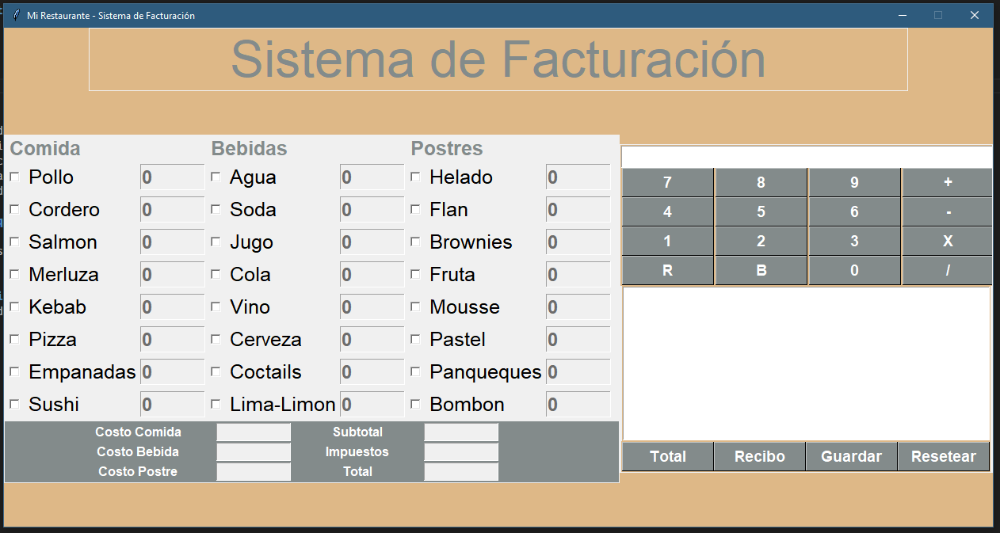

# Restaurant Billing Software

## Description

The Restaurant Billing Software is a user-friendly desktop application built using Python and Tkinter, designed specifically for restaurants. It simplifies the process of generating customer bills by allowing users to set the quantity of meals, beverages, and desserts ordered. The software then calculates the total, subtotals, and taxes, and includes a built-in calculator for added convenience.

## Screenshots




## Features

- Streamlined bill generation for restaurants.
- Easy quantity input for meals, beverages, and desserts.
- Automatic calculation of totals, subtotals, and taxes.
- Built-in calculator for additional calculations.
- On-screen display and downloadable ticket generation.

## System Requirements

- Python 3.x
- Tkinter
- os
- re
- datetime
- pathlib
- typing

## Installation

1. Clone or download this repository:

   ```bash
   git clone https://github.com/Mgobeaalcoba/restaurant_desktop_soft_tkinter.git
   ```

2. Execute the main.py file with Python3
